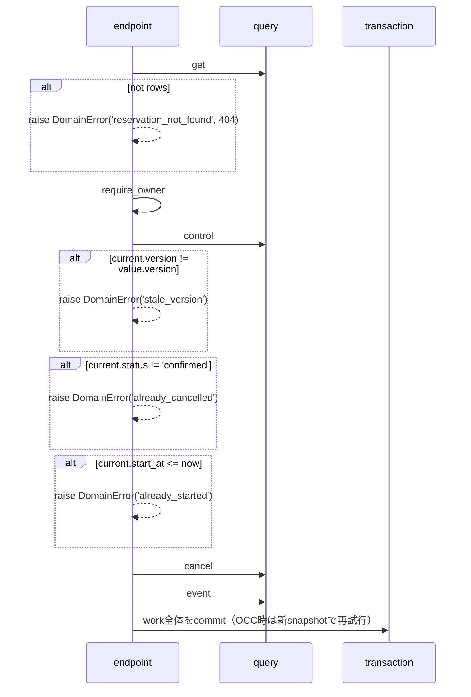

# reservations_cancel / Sequence

```mermaid
sequenceDiagram
participant E as endpoint
participant Q as query
participant D as transaction
E->>Q: get
alt not rows
E-->>E: raise DomainError('reservation_not_found', 404)
end
E->>E: require_owner
E->>Q: control
alt current.version != value.version
E-->>E: raise DomainError('stale_version')
end
alt current.status != 'confirmed'
E-->>E: raise DomainError('already_cancelled')
end
alt current.start_at <= now
E-->>E: raise DomainError('already_started')
end
E->>Q: cancel
E->>Q: event
E->>D: work全体をcommit（OCC時は新snapshotで再試行）
```
