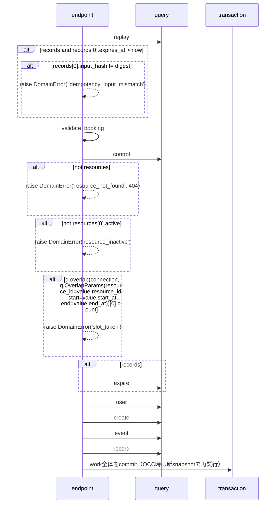

# reservations_create / Sequence

```mermaid
sequenceDiagram
participant E as endpoint
participant Q as query
participant D as transaction
E->>Q: replay
alt records and records[0].expires_at > now
alt records[0].input_hash != digest
E-->>E: raise DomainError('idempotency_input_mismatch')
end
end
E->>E: validate_booking
E->>Q: control
alt not resources
E-->>E: raise DomainError('resource_not_found', 404)
end
alt not resources[0].active
E-->>E: raise DomainError('resource_inactive')
end
alt q.overlap(connection, q.OverlapParams(resource_id=value.resource_id, start=value.start_at, end=value.end_at))[0].count
E-->>E: raise DomainError('slot_taken')
end
alt records
E->>Q: expire
end
E->>Q: user
E->>Q: create
E->>Q: event
E->>Q: record
E->>D: work全体をcommit（OCC時は新snapshotで再試行）
```
