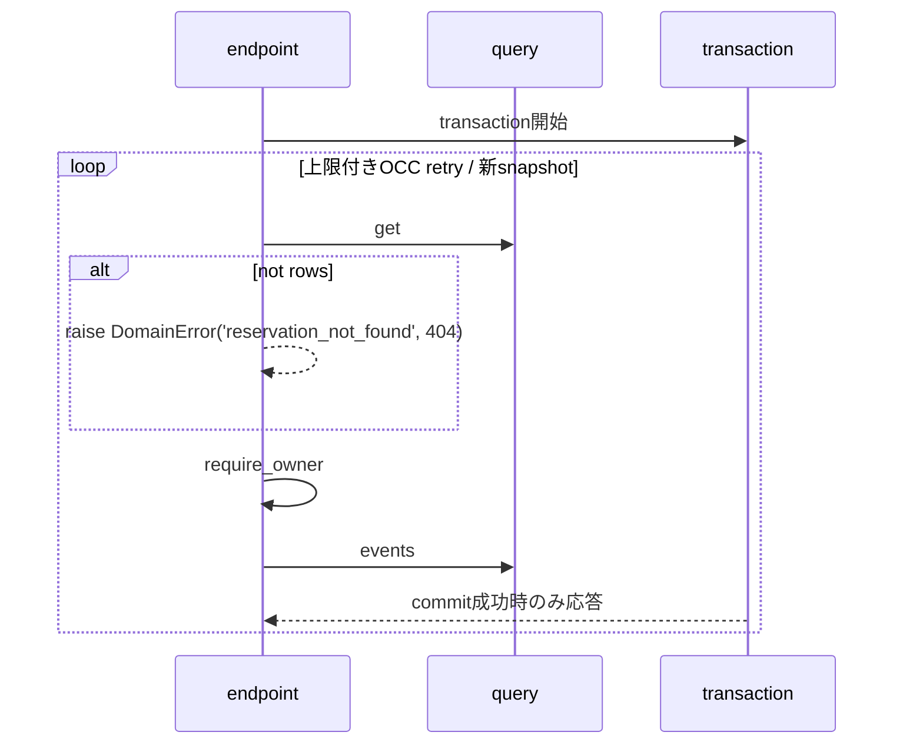

# reservations_get / Sequence

```mermaid
sequenceDiagram
participant E as endpoint
participant Q as query
participant D as transaction
E->>D: transaction開始
loop 上限付きOCC retry / 新snapshot
E->>Q: get
alt not rows
E-->>E: raise DomainError('reservation_not_found', 404)
end
E->>E: require_owner
E->>Q: events
D-->>E: commit成功時のみ応答
end
```
