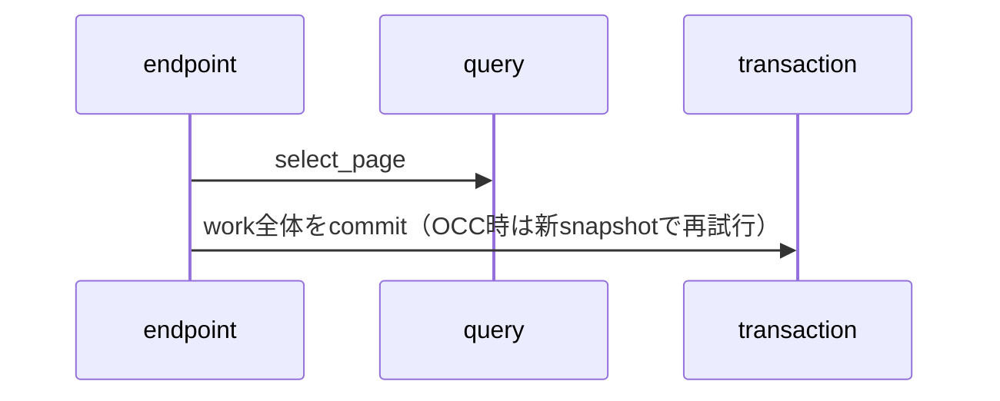

# reservations_list / Sequence

```mermaid
sequenceDiagram
participant E as endpoint
participant Q as query
participant D as transaction
E->>Q: select_page
E->>D: work全体をcommit（OCC時は新snapshotで再試行）
```
