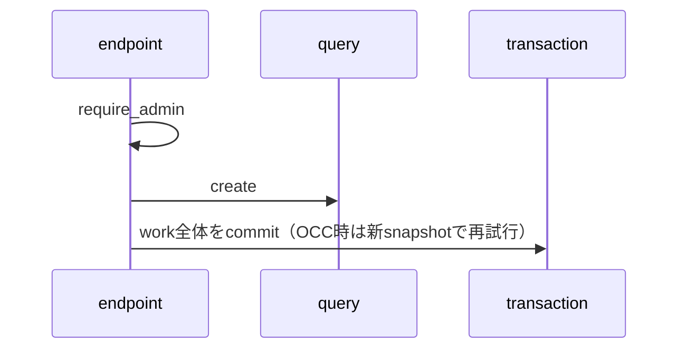

# resources_create / Sequence

```mermaid
sequenceDiagram
participant E as endpoint
participant Q as query
participant D as transaction
E->>E: require_admin
E->>Q: create
E->>D: work全体をcommit（OCC時は新snapshotで再試行）
```
