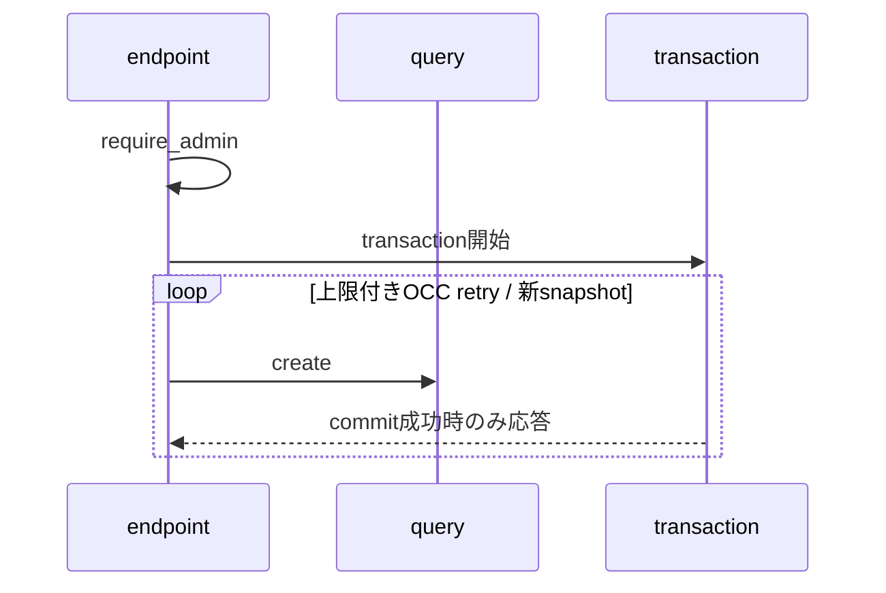

# resources_create / Sequence

```mermaid
sequenceDiagram
participant E as endpoint
participant Q as query
participant D as transaction
E->>E: require_admin
E->>D: transaction開始
loop 上限付きOCC retry / 新snapshot
E->>Q: create
D-->>E: commit成功時のみ応答
end
```
