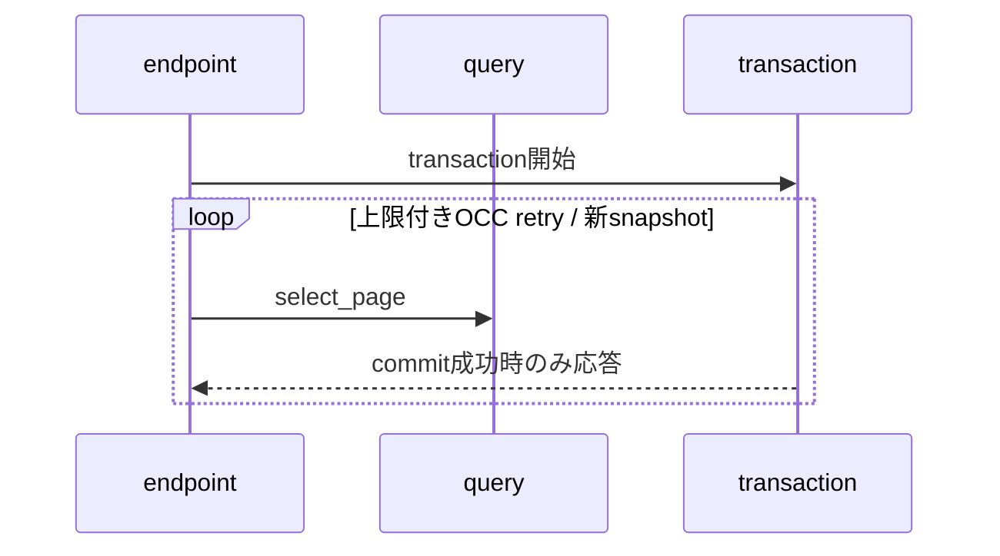

# resources_list / Sequence

```mermaid
sequenceDiagram
participant E as endpoint
participant Q as query
participant D as transaction
E->>D: transaction開始
loop 上限付きOCC retry / 新snapshot
E->>Q: select_page
D-->>E: commit成功時のみ応答
end
```
