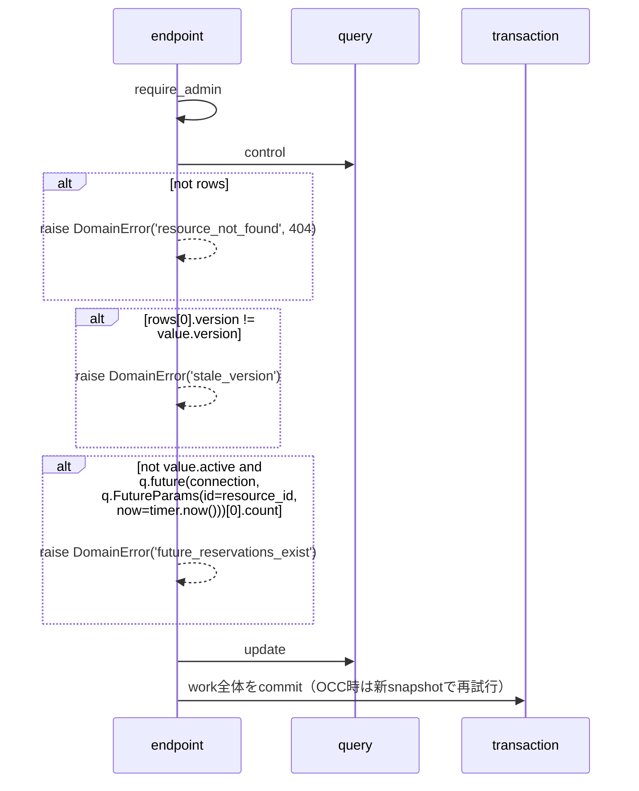

# resources_update / Sequence

```mermaid
sequenceDiagram
participant E as endpoint
participant Q as query
participant D as transaction
E->>E: require_admin
E->>Q: control
alt not rows
E-->>E: raise DomainError('resource_not_found', 404)
end
alt rows[0].version != value.version
E-->>E: raise DomainError('stale_version')
end
alt not value.active and q.future(connection, q.FutureParams(id=resource_id, now=timer.now()))[0].count
E-->>E: raise DomainError('future_reservations_exist')
end
E->>Q: update
E->>D: work全体をcommit（OCC時は新snapshotで再試行）
```
