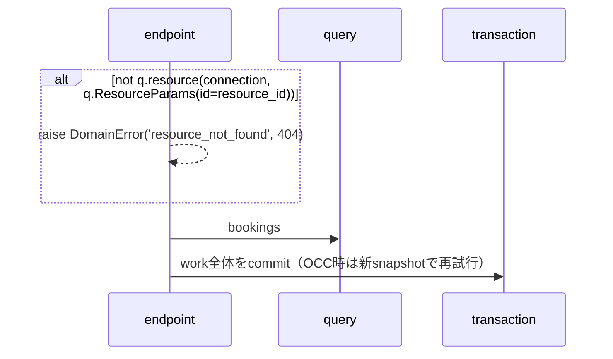

# schedule / Sequence

```mermaid
sequenceDiagram
participant E as endpoint
participant Q as query
participant D as transaction
alt not q.resource(connection, q.ResourceParams(id=resource_id))
E-->>E: raise DomainError('resource_not_found', 404)
end
E->>Q: bookings
E->>D: work全体をcommit（OCC時は新snapshotで再試行）
```
