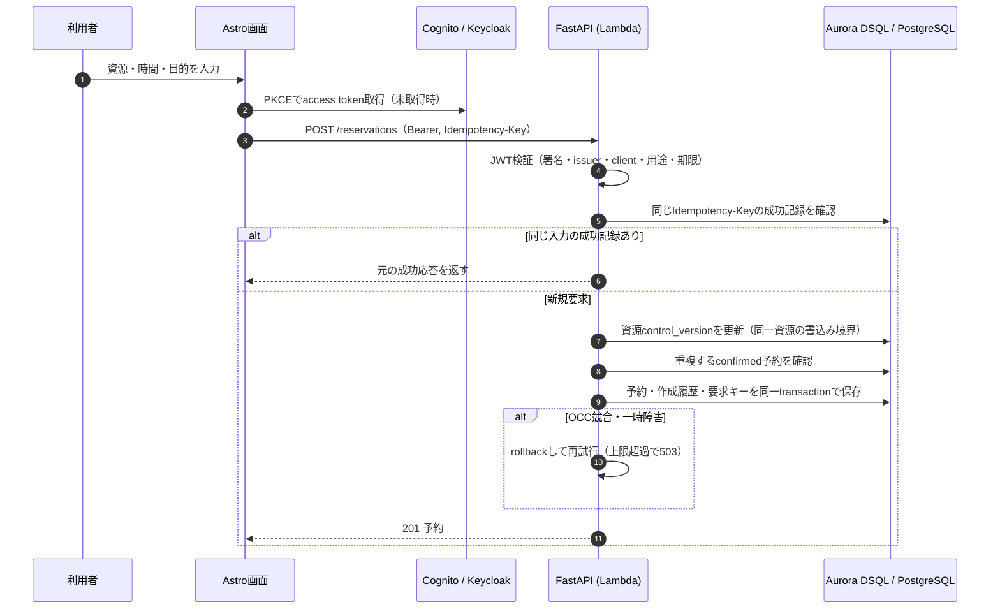

# 予約作成シーケンス

API単位の詳細な分岐は生成帳票 [create_reservation sequence](../../40.apis/reservations/create_reservation/sequence_gen.md) を正とする。本書は画面から永続化までの全体像を示す。

```mermaid
sequenceDiagram
  autonumber
  participant User as 利用者
  participant Web as Astro画面
  participant IdP as Cognito / Keycloak
  participant API as FastAPI (Lambda)
  participant DB as Aurora DSQL / PostgreSQL
  User->>Web: 資源・時間・目的を入力
  Web->>IdP: PKCEでaccess token取得（未取得時）
  Web->>API: POST /reservations（Bearer, Idempotency-Key）
  API->>API: JWT検証（署名・issuer・client・用途・期限）
  API->>DB: 同じIdempotency-Keyの成功記録を確認
  alt 同じ入力の成功記録あり
    API-->>Web: 元の成功応答を返す
  else 新規要求
    API->>DB: 資源control_versionを更新（同一資源の書込み境界）
    API->>DB: 重複するconfirmed予約を確認
    API->>DB: 予約・作成履歴・要求キーを同一transactionで保存
    alt OCC競合・一時障害
      API->>API: rollbackして再試行（上限超過で503）
    end
    API-->>Web: 201 予約
  end
```
