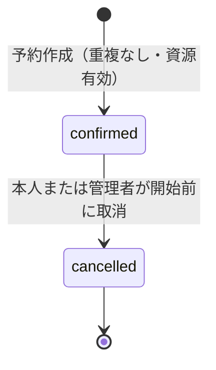
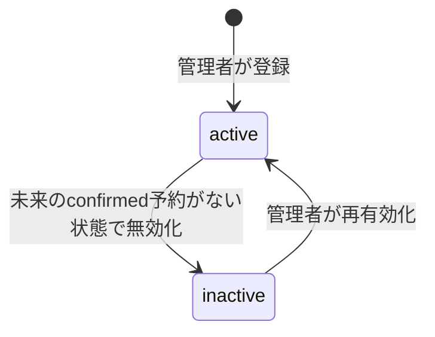

# 予約と資源の状態

## 予約

- 予約区間は`[開始, 終了)`。終了済みかどうかは時刻から判定し、状態として二重管理しない。
- `cancelled`は重複判定から除き、取消の確定と同時にその枠を再予約できる。
- 取消済み予約への取消は409（`already_cancelled`）で、履歴を追加しない。
- 楽観ロックの公開`version`が取得時と異なる取消は409（`stale_version`）。

## 資源

- `inactive`の資源には新規予約できない（`resource_inactive`）。
- 未来のconfirmed予約がある資源は無効化できない（`future_reservations_exist`）。
- 予約作成・取消・無効化は内部`control_version`を更新して同一資源の書込みを直列化する。
